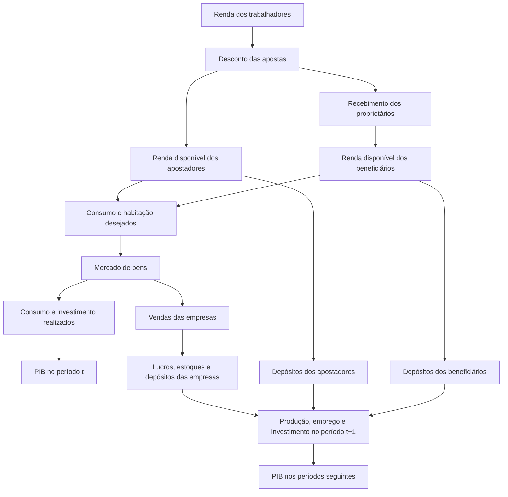

# Plano de análise do caminho da renda até o PIB

## Objetivo

Analisar as simulações pareadas dos cenários com e sem mercado de apostas para responder a duas perguntas distintas:

1. O PIB real foi maior quando o mercado de apostas estava ativo?
2. Se foi, por quais mecanismos a transferência de renda chegou aos componentes do PIB?

A análise deve reconstruir a sequência entre a renda dos agentes, os gastos desejados, as transações realizadas, os resultados das empresas e o PIB. Uma diferença positiva no PIB, isoladamente, não será tratada como demonstração do mecanismo.

## Estado atual

Os resultados existentes estão em:

- [`paired-results.csv`](data/paired-results.csv): resultados finais e acumulados de 20 pares de simulações;
- [`paired-gdp-paths.csv`](data/paired-gdp-paths.csv): trajetória do PIB real por execução, cenário e período;
- [`paired-period-trace.csv`](data/paired-period-trace.csv): rastreamento detalhado da transferência, das famílias, das empresas e dos componentes do PIB em cada período;
- [`run-paired-experiment.jl`](run-paired-experiment.jl): configuração e execução do experimento.

O script e os CSVs atuais usam `gambling_income_share = 0.02`. Portanto, os resultados representam uma transferência de 2% da renda dos participantes. O experimento contém 20 pares, dois cenários por par e 17 observações por cenário, incluindo o período inicial. Os arquivos por período possuem, assim, 680 linhas.

O rastreamento detalhado já foi incorporado ao experimento. As verificações automáticas confirmam que:

- o cenário de referência tem volume de apostas igual a zero;
- o valor apostado é igual ao valor recebido pelos proprietários, salvo tolerância numérica;
- o volume agregado registrado coincide com a soma das apostas dos trabalhadores ativos e inativos;
- as identidades contábeis do PIB real e nominal fecham dentro da tolerância numérica;
- cada par usa a mesma semente de simulação e a mesma seleção de participantes.

Os 20 pares existentes com transferência de 2% apresentam:

- PIB real final médio de `75.181,5` no cenário de referência;
- PIB real final médio de `76.465,3` no cenário com apostas;
- diferença final média de `+1.283,8`, equivalente a aproximadamente `+1,71%`;
- PIB final maior em 14 dos 20 pares;
- diferença média de `+611,4` ao longo dos 16 períodos simulados, positiva em 16 dos 20 pares.

O intervalo aproximado de 95% para a diferença final inclui zero. A diferença média ao longo do horizonte é mais estável, mas deve ser apresentada junto com a dispersão entre execuções.

O consumo nominal acumulado aumentou em média, porém caiu em 11 dos 20 pares. Portanto, os resultados atuais não permitem concluir que o PIB aumentou simplesmente por causa de um crescimento do consumo agregado.

## Hipótese econômica

O mecanismo de apostas é uma transferência de soma zero entre famílias. Trabalhadores selecionados perdem uma parcela da renda disponível, enquanto proprietários de empresas selecionados recebem exatamente o mesmo valor.

Como os tipos de família usam as mesmas propensões ao consumo e ao investimento residencial, a transferência não deve elevar mecanicamente a demanda desejada agregada. O efeito macroeconômico precisa surgir da nova distribuição dos orçamentos entre agentes e de sua interação com:

- restrições de liquidez;
- ordem de atendimento dos compradores;
- pareamento no mercado de bens;
- disponibilidade de produtos domésticos e importados;
- vendas, lucros e estoques das empresas;
- decisões posteriores de produção, emprego, investimento e crédito.

## Desenho da comparação

As simulações devem permanecer pareadas. Cada execução dos dois cenários deve usar:

- a mesma semente de simulação;
- os mesmos trabalhadores selecionados;
- os mesmos proprietários beneficiários;
- os mesmos parâmetros, exceto `gambling_income_share`.

Para qualquer variável `X`, a unidade básica da análise será a diferença pareada:

$$
\Delta X_{r,t} = X^{apostas}_{r,t} - X^{baseline}_{r,t},
$$

onde `r` identifica a execução e `t` o período.

As comparações principais serão:

- diferença no PIB real em cada período;
- diferença no PIB real final;
- média da diferença no PIB ao longo do horizonte;
- número e proporção de pares com diferença positiva;
- média, mediana, dispersão e intervalo de confiança das diferenças pareadas.

## Dados disponíveis no rastreamento

`data/paired-results.csv` contém apenas depósitos finais, consumo nominal acumulado e volume acumulado de apostas. O caminho completo da renda foi acrescentado em `data/paired-period-trace.csv`.

O novo arquivo possui uma linha por execução, cenário e período, com 75 campos organizados nos grupos abaixo.

### Identificação

| Campo | Descrição |
|---|---|
| `run` | Número da execução pareada |
| `scenario` | `baseline` ou `gambling` |
| `simulation_seed` | Semente da simulação |
| `period` | Período simulado |
| `gambling_income_share` | Parcela da renda transferida |

### Transferência de renda

| Campo | Descrição |
|---|---|
| `active_worker_stakes` | Total transferido por trabalhadores ativos |
| `inactive_worker_stakes` | Total transferido por trabalhadores inativos |
| `owner_receipts` | Total recebido pelos proprietários selecionados |
| `transfer_residual` | Apostas menos recebimentos; deve ser aproximadamente zero |
| `gambling_volume` | Volume agregado registrado pelo modelo |

### Renda, gastos e depósitos por grupo

O arquivo registra totais para:

- trabalhadores apostadores ativos;
- trabalhadores apostadores inativos;
- trabalhadores não apostadores;
- proprietários beneficiários;
- proprietários não beneficiários.

Para cada grupo, são registrados:

| Medida | Campos do modelo |
|---|---|
| Renda realizada | `Y_h` |
| Consumo desejado | `C_d_h` |
| Consumo realizado | `C_h` |
| Investimento residencial desejado | `I_d_h` |
| Investimento residencial realizado | `I_h` |
| Depósitos | `D_h` |

Os totais serão usados para verificar conservação e efeitos agregados. Quando necessário, as médias por agente serão calculadas no notebook a partir do número de participantes de cada grupo.

### Empresas e propagação produtiva

| Medida | Cálculo ou campo |
|---|---|
| Produção planejada | `sum(Q_s_i)` |
| Produção realizada | `sum(Y_i)` |
| Vendas reais | `sum(Q_i)` |
| Receita nominal | `sum(P_i .* Q_i)` |
| Lucros | `sum(Pi_i)` |
| Emprego | `sum(N_i)` |
| Investimento | `sum(I_i)` |
| Crédito desejado | `sum(DL_d_i)` |
| Crédito realizado | `sum(DL_i)` |
| Estoques | totais de capital, insumos e produtos acabados |

### Componentes do PIB

Os componentes já são armazenados em [`src/utils/data.jl`](../../src/utils/data.jl):

- `real_gdp`;
- `real_household_consumption`;
- `real_government_consumption`;
- `real_capitalformation`;
- `real_exports`;
- `real_imports`;
- `real_gva`;
- `real_sector_gva`.

O rastreamento também exporta os componentes nominais e os resíduos das identidades contábeis do PIB real e nominal. Isso permite manter separadas as comparações em valores reais e nominais.

## Etapas da análise

### Pré-condição: validação do experimento

As validações que interrompem o experimento em caso de inconsistência já estão em `run-paired-experiment.jl`. Como todas passaram na execução atual, elas são tratadas como uma pré-condição e não serão reapresentadas na Parte 4:

1. confirmar a parcela de renda usada na execução;
2. verificar que os estados iniciais dos cenários são iguais;
3. confirmar que o cenário de referência tem volume de apostas igual a zero;
4. verificar que apostas e recebimentos são iguais em cada período;
5. confirmar que ambos os cenários usam a mesma semente e seleção de agentes;
6. verificar as identidades contábeis do modelo.

Se os dados forem gerados novamente, essas verificações devem continuar passando antes da execução do notebook.

### 1. Efeito pareado sobre o PIB

Construir primeiro uma tabela pareada, juntando `baseline` e `gambling` pelas chaves `run`, `simulation_seed` e `period`. Para toda variável `X`, criar a coluna `delta_X = X_gambling - X_baseline`.

Construir a trajetória de `ΔPIB` para cada execução e resumir:

- média e mediana por período;
- intervalo de confiança por período;
- número de diferenças positivas;
- diferença final;
- diferença média ao longo do horizonte.

O gráfico principal deve mostrar a trajetória média de `ΔPIB`, uma faixa de incerteza e a linha de referência em zero.

### 2. Decomposição contábil do PIB

Para cada execução e período, calcular:

$$
\Delta PIB
=
\Delta C + \Delta G + \Delta I + \Delta X - \Delta M + \varepsilon,
$$

onde `ε` é o resíduo de reconciliação e deve ser aproximadamente zero.

Essa decomposição mostrará se a diferença no PIB veio principalmente de:

- consumo das famílias;
- consumo público;
- formação de capital e estoques;
- exportações;
- importações.

Não comparar diretamente consumo nominal acumulado com PIB real final. As variáveis devem ter a mesma frequência e a mesma base de preços.

### 3. Propagação para as empresas

Após identificar o componente do PIB responsável pela diferença, analisar a sequência empresarial:

$$
\text{gasto realizado}
\rightarrow
\text{vendas}
\rightarrow
\text{lucros e estoques}
\rightarrow
\text{produção, emprego e investimento futuros}
\rightarrow
\text{PIB}.
$$

Devem ser comparados os efeitos no próprio período e no período seguinte. Conforme a ordem em [`src/one_step.jl`](../../src/one_step.jl), a produção ocorre antes da transferência realizada. Assim, parte relevante do efeito produtivo deve aparecer com defasagem.

### 4. Robustez estatística

Com as 20 execuções atuais, apresentar os resultados como exploratórios. Usar diferenças pareadas e reportar:

- média;
- mediana;
- desvio-padrão;
- intervalo de confiança;
- proporção de efeitos positivos.

Se a conclusão substantiva depender de um efeito pequeno ou instável, aumentar o número de sementes. Não selecionar somente as execuções com maior efeito nem escolher retrospectivamente apenas o período mais favorável.

## Estrutura proposta para a Parte 4

O notebook [`exploracao-beforeIT-aux1_pt4.ipynb`](exploracao-beforeIT-aux1_pt4.ipynb) deve seguir esta ordem:

1. pergunta de pesquisa e hipótese;
2. descrição do experimento pareado;
3. trajetória pareada do PIB;
4. decomposição do PIB por componentes;
5. efeitos contemporâneos e defasados sobre vendas, lucros, produção e emprego;
6. robustez entre sementes;
7. conclusão e limitações.

### Gráficos mínimos

1. Trajetória média de `ΔPIB` com intervalo de confiança.
2. Distribuição da diferença pareada no PIB final e no PIB médio.
3. Trajetórias pareadas de vendas, lucros, produção e emprego.
4. Decomposição de `ΔPIB` em `ΔC`, `ΔG`, `ΔI`, `ΔX` e `-ΔM`.

Para ilustrar um caminho individual, usar a execução com efeito mediano, e não a execução de maior crescimento. As conclusões principais devem usar a média e a distribuição dos pares.

## Critérios para a conclusão

A Parte 4 poderá afirmar que o PIB foi maior no cenário com apostas se:

1. a diferença pareada for positiva em média e sua incerteza for apresentada;
2. o resultado não depender de poucas execuções extremas;
3. a decomposição dos componentes reconciliar com a diferença do PIB;
4. as variáveis intermediárias mostrarem uma sequência temporal coerente.

Como a Parte 4 não apresentará o caminho detalhado da renda por grupo, sua conclusão deve ser limitada ao efeito pareado, à decomposição contábil e às associações observadas nas empresas, sem afirmar que identificou integralmente o mecanismo causal.

## Estado da implementação

- [x] Ajustar [`run-paired-experiment.jl`](run-paired-experiment.jl) para executar `Bit.step!` período a período.
- [x] Coletar os agregados descritos acima após cada passo.
- [x] Escrever `data/paired-period-trace.csv` ao final do experimento.
- [x] Manter os CSVs anteriores para comparabilidade.
- [x] Executar 20 pares com `gambling_income_share = 0.02`.
- [x] Validar a conservação da transferência e as identidades contábeis do PIB.
- [x] Construir a tabela de diferenças pareadas na Parte 4.
- [x] Produzir a trajetória e a decomposição de `ΔPIB`.
- [x] Avaliar efeitos contemporâneos e defasados.
- [x] Redigir conclusões e limitações.

## Análise implementada

A análise foi implementada em [`exploracao-beforeIT-aux1_pt4.ipynb`](exploracao-beforeIT-aux1_pt4.ipynb):

1. carregar `data/paired-period-trace.csv`;
2. juntar os cenários por `run`, `simulation_seed` e `period`;
3. calcular as diferenças `gambling - baseline`;
4. apresentar a trajetória de `ΔPIB`;
5. reconciliar `ΔPIB` com `ΔC + ΔG + ΔI + ΔX - ΔM`.

A reconciliação é seguida pela análise da propagação pelas empresas e das associações contemporâneas e defasadas. O notebook foi executado integralmente e preserva as tabelas e os gráficos produzidos.

A primeira versão deve evitar mudanças no núcleo do modelo. Novos campos em `Data` ou `Aggregates` só devem ser adicionados se os valores necessários não puderem ser coletados externamente pelo experimento.

## Referências internas

- [`implementation-plan.md`](implementation-plan.md): desenho e hipóteses do mecanismo de apostas;
- [`exploracao-beforeIT-pt2.ipynb`](exploracao-beforeIT-pt2.ipynb): ordem detalhada das funções do passo de simulação;
- [`exploracao-beforeIT-pt3.ipynb`](exploracao-beforeIT-pt3.ipynb): metodologia consolidada do modelo;
- [`src/agent_actions/households.jl`](../../src/agent_actions/households.jl): cálculo e aplicação das transferências;
- [`src/one_step.jl`](../../src/one_step.jl): ordem econômica e contábil do período;
- [`src/utils/data.jl`](../../src/utils/data.jl): séries macroeconômicas coletadas pelo modelo.
