# BeforeIT model execution loop

```mermaid
flowchart TD
    A[Model already initialized] --> B{{For each period 1 to T}}
    B --> C[finance_insolvent_firms!]

    subgraph estimates[1. General estimations]
      C --> D[Set domestic growth and inflation expectations]
      D --> E[Draw external innovations]
      E --> F[Update euro-area growth and inflation]
      F --> G[Set central-bank policy rate]
      G --> H[Apply optional shock]
      H --> I[Set bank loan and mortgage rate]
    end

    subgraph decisions[2. Firm expectations and decisions]
      I --> J["Decide quantities, prices, investment,<br/>inputs, employment, profits, loans, and capital"]
    end

    subgraph production[3. Credit, labour, and production]
      J --> K[Match firms with credit]
      K --> L[Match firms with workers]
      L --> M[Set firm wages and production]
      M --> N[Update worker wages]
    end

    subgraph budgets[4. Household budgets]
      N --> O[Update government social benefits]
      O --> P[Update expected bank profits]
      P --> Q["Set consumption and investment budgets<br/>for active workers, inactive workers,<br/>firm owners, and the bank owner"]
    end

    subgraph public_external[5. Public and external demand]
      Q --> R[Set government expenditure]
      R --> S[Set export demand and import supply]
    end

    subgraph goods[6. Goods market]
      S --> U[Search and match all buyers and sellers]
    end

    subgraph accounting[7. Prices and final accounting]
      U --> V[Update inflation and price indices]
      V --> W["Update firm stocks, profits,<br/>bank profits, and bank equity"]
      W --> X[Update household income and deposits]
      X --> Y["Update central-bank equity,<br/>government revenue and debt"]
      Y --> Z[Update firm deposits, loans, and equity]
      Z --> AA[Update rest-of-world and bank positions]
      AA --> AB[Update GDP]
      AB --> AC[Advance model time]
    end

    AC --> AD[collect_data!]
    AD --> AE{More periods?}
    AE -- Yes --> C
    AE -- No --> AF[Return updated model]
```

The outer loop is `run!(model, T)`. Each iteration calls `step!(model)` and then
`collect_data!(model)`. The numbered groups preserve the execution order in
`src/one_step.jl`; items combined into one node are consecutive calls serving
the same accounting stage.
